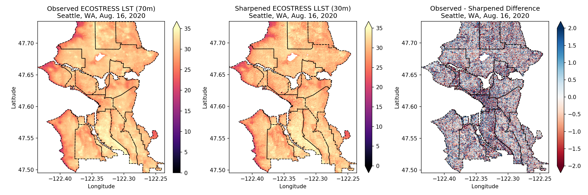

# urban-heat-hack
Urban Heat Island Hackathon https://urbancanopy.io/earthhacks 

Thermal sharpening with ECOSTRESS & Landsat 8: [thermal-sharpening.ipynb](notebooks/thermal-sharpening.ipynb)

Zonal statistics with ECOSTRESS for Seattle neighborhoods: [eco-seattle.ipynb](notebooks/eco-seattle.ipynb)
