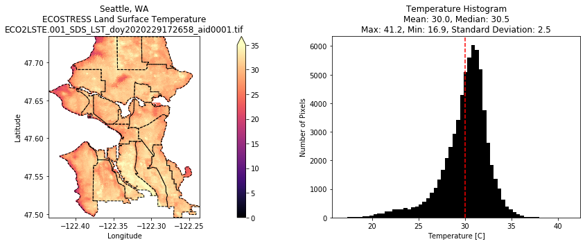

# urban-heat-hack
Urban Heat Island Hackathon https://urbancanopy.io/earthhacks 

Thermal sharpening with ECOSTRESS & Landsat 8: [thermal-sharpening.ipynb](https://nbviewer.org/urls/spestana.github.io/urban-heat-hack/notebooks/thermal-sharpening.ipynb)

Zonal statistics with ECOSTRESS for Seattle neighborhoods: [eco-seattle.ipynb](https://nbviewer.org/urls/spestana.github.io/urban-heat-hack/notebooks/eco-seattle.ipynb)

